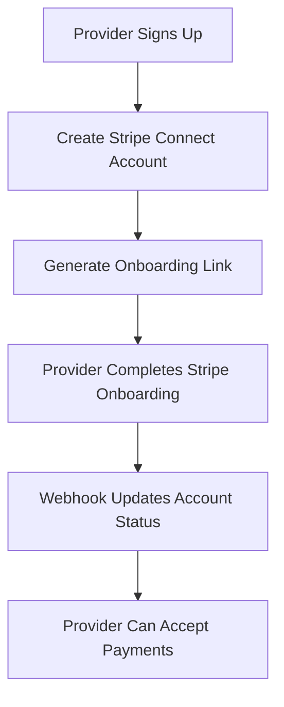
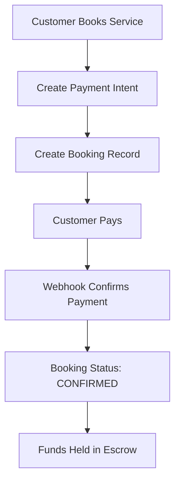
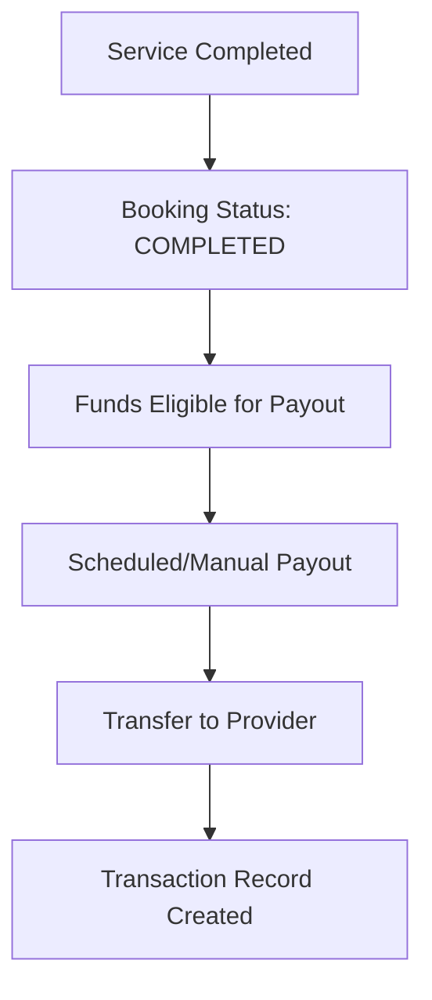

# Stripe Connect Integration - Complete Implementation Guide

This document provides comprehensive documentation for the Stripe Connect integration in the marketplace platform. The implementation handles provider onboarding, payment processing with 8% commission, automated payouts, and refund management.

## Overview

The Stripe Connect integration consists of 5 Lambda functions that handle the complete payment lifecycle:

1. **booking-processor**: Creates bookings with integrated payment processing
2. **stripe-connect**: Manages Stripe Connect account creation and direct operations
3. **stripe-webhook**: Processes Stripe webhooks and updates application state
4. **payout-manager**: Handles automated and manual provider payouts
5. **refund-processor**: Manages refunds with proper commission handling

## Architecture

```
Frontend → API Gateway → Lambda Functions → Stripe API
                    ↓
                 DynamoDB Tables
```

### Database Schema Updates

The `UserProfile` model has been enhanced with Stripe-specific fields:

```typescript
// New Stripe-related fields in UserProfile
stripeAccountId: string
stripeOnboardingComplete: boolean
stripeAccountStatus: 'PENDING' | 'ACTIVE' | 'RESTRICTED' | 'REJECTED'
stripeChargesEnabled: boolean
stripePayoutsEnabled: boolean
stripeDetailsSubmitted: boolean
stripeRequirements: json
stripeCapabilities: json
stripeOnboardingUrl: url
```

## Lambda Functions

### 1. Booking Processor (`/functions/booking-processor`)

Handles the complete booking creation flow with payment integration.

**Endpoints:**
- `POST /booking-processor` with `action: 'CREATE_BOOKING'`
- `POST /booking-processor` with `action: 'CONFIRM_BOOKING'`
- `POST /booking-processor` with `action: 'CANCEL_BOOKING'`
- `POST /booking-processor` with `action: 'CHECK_AVAILABILITY'`

**Example: Create Booking**
```json
{
  "action": "CREATE_BOOKING",
  "serviceId": "service-123",
  "customerId": "customer-456",
  "customerEmail": "customer@example.com",
  "startDateTime": "2024-12-01T10:00:00Z",
  "endDateTime": "2024-12-01T12:00:00Z",
  "groupSize": 2,
  "specialRequests": "Please provide parking"
}
```

**Response:**
```json
{
  "bookingId": "booking-789",
  "clientSecret": "pi_1234567890_secret_xyz",
  "booking": {
    "id": "booking-789",
    "status": "PENDING",
    "service": {
      "title": "Photography Session",
      "category": "SERVICE"
    },
    "dateTime": {
      "start": "2024-12-01T10:00:00Z",
      "end": "2024-12-01T12:00:00Z"
    },
    "pricing": {
      "totalAmount": 200,
      "platformFee": 16,
      "providerEarnings": 184,
      "platformFeeRate": 0.08
    },
    "qrCode": "qr_booking-789"
  }
}
```

### 2. Stripe Connect (`/functions/stripe-connect`)

Manages Stripe Connect accounts and payment processing.

**Endpoints:**
- `POST /stripe-connect` with `action: 'CREATE_ACCOUNT'`
- `POST /stripe-connect` with `action: 'CREATE_ACCOUNT_LINK'`
- `POST /stripe-connect` with `action: 'CHECK_ACCOUNT_STATUS'`
- `POST /stripe-connect` with `action: 'CREATE_PAYMENT_INTENT'`
- `POST /stripe-connect` with `action: 'CREATE_PAYOUT'`

**Example: Create Connect Account**
```json
{
  "action": "CREATE_ACCOUNT",
  "providerId": "provider-123"
}
```

**Response:**
```json
{
  "accountId": "acct_1234567890",
  "onboardingUrl": "https://connect.stripe.com/setup/e/acct_1234567890/xyz"
}
```

### 3. Stripe Webhook (`/functions/stripe-webhook`)

Processes Stripe webhook events automatically.

**Supported Events:**
- `account.updated` - Updates provider onboarding status
- `payment_intent.succeeded` - Confirms booking and creates transaction record
- `payment_intent.payment_failed` - Handles payment failures
- `charge.succeeded` - Updates transaction with charge details
- `transfer.created/updated` - Tracks provider transfers
- `payout.created/updated/paid/failed` - Manages payout status
- `invoice.payment_succeeded` - Handles subscription payments
- `customer.subscription.*` - Manages subscription updates
- `charge.dispute.created` - Initiates dispute handling

### 4. Payout Manager (`/functions/payout-manager`)

Handles provider payouts with scheduling and automation.

**Endpoints:**
- `POST /payout-manager` with `action: 'CALCULATE_EARNINGS'`
- `POST /payout-manager` with `action: 'SCHEDULE_PAYOUT'`
- `POST /payout-manager` with `action: 'INSTANT_PAYOUT'`
- `POST /payout-manager` with `action: 'GET_PAYOUT_HISTORY'`

**Scheduled Event Support:**
Can be triggered by EventBridge for automated daily/weekly payouts.

**Example: Calculate Earnings**
```json
{
  "action": "CALCULATE_EARNINGS",
  "providerId": "provider-123"
}
```

**Response:**
```json
{
  "providerId": "provider-123",
  "totalEarnings": 1250.50,
  "bookingCount": 8,
  "eligibleBookings": [
    {
      "bookingId": "booking-456",
      "amount": 184.00,
      "completedAt": "2024-11-28T15:30:00Z"
    }
  ],
  "currency": "USD"
}
```

### 5. Refund Processor (`/functions/refund-processor`)

Manages refunds with commission handling and cancellation policies.

**Endpoints:**
- `POST /refund-processor` with `action: 'PROCESS_REFUND'`
- `POST /refund-processor` with `action: 'CALCULATE_REFUND'`
- `POST /refund-processor` with `action: 'GET_REFUND_STATUS'`
- `POST /refund-processor` with `action: 'DISPUTE_REFUND'`

**Example: Process Refund**
```json
{
  "action": "PROCESS_REFUND",
  "bookingId": "booking-789",
  "refundAmount": 150,
  "reason": "customer_request",
  "providerCompensation": 50
}
```

## Payment Flow

### 1. Provider Onboarding


### 2. Booking and Payment


### 3. Service Completion and Payout


## Commission Structure

- **Platform Fee**: 8% of total booking amount
- **Provider Earnings**: 92% of total booking amount
- **Refund Handling**: Platform fee proportionally refunded

## Security Features

### 1. Webhook Security
- Stripe signature verification for all webhook events
- Event idempotency handling to prevent duplicate processing
- Structured logging for audit trails

### 2. Payment Security
- All payments processed through Stripe Connect
- Funds held in escrow until service completion
- Automatic dispute handling integration

### 3. Data Protection
- All secrets stored in AWS Secrets Manager
- Environment-specific configurations
- IAM roles with least privilege access

## Error Handling

### Common Error Scenarios

1. **Provider Account Not Set Up**
   ```json
   {
     "error": "Provider payment processing not set up",
     "code": 400
   }
   ```

2. **Insufficient Earnings**
   ```json
   {
     "error": "Insufficient earnings",
     "available": 125.50,
     "requested": 200.00,
     "code": 400
   }
   ```

3. **Booking Not Refundable**
   ```json
   {
     "error": "Booking is not in a refundable state",
     "currentStatus": "COMPLETED",
     "code": 400
   }
   ```

## Testing with Stripe Test Mode

### Test Cards
```javascript
// Successful payment
const testCard = '4242424242424242';

// Declined payment
const declinedCard = '4000000000000002';

// Requires authentication
const authCard = '4000002500003155';
```

### Test Webhooks
Use Stripe CLI to forward webhooks to local development:
```bash
stripe listen --forward-to localhost:3000/api/stripe-webhook
```

## Deployment Configuration

### 1. Set Required Secrets
```bash
# Development
npx ampx sandbox secret set STRIPE_SECRET_KEY sk_test_51RxWCID905P0bnNcybVX55XQBnYcikWljrcbotmAmd9IAkhUSqgVlzqp4eBNrpqagzPRqOvTw8UvnqpqfHbjhp5u00g6WkdVsp
npx ampx sandbox secret set STRIPE_WEBHOOK_SECRET whsec_test_your_webhook_secret
npx ampx sandbox secret set APP_URL http://localhost:3000
npx ampx sandbox secret set USER_PROFILE_TABLE_NAME UserProfile-sandbox
npx ampx sandbox secret set SERVICE_TABLE_NAME Service-sandbox
npx ampx sandbox secret set BOOKING_TABLE_NAME Booking-sandbox
npx ampx sandbox secret set TRANSACTION_TABLE_NAME Transaction-sandbox

# Production
npx ampx pipeline-deploy secret set STRIPE_SECRET_KEY sk_live_YOUR_LIVE_SECRET_KEY
npx ampx pipeline-deploy secret set STRIPE_WEBHOOK_SECRET whsec_YOUR_PRODUCTION_WEBHOOK_SECRET
npx ampx pipeline-deploy secret set APP_URL https://your-production-domain.com
npx ampx pipeline-deploy secret set USER_PROFILE_TABLE_NAME UserProfile-production
npx ampx pipeline-deploy secret set SERVICE_TABLE_NAME Service-production
npx ampx pipeline-deploy secret set BOOKING_TABLE_NAME Booking-production
npx ampx pipeline-deploy secret set TRANSACTION_TABLE_NAME Transaction-production
```

### 2. Configure Stripe Dashboard
1. Create webhook endpoints for each environment
2. Enable required webhook events:
   - `account.updated`
   - `payment_intent.succeeded`
   - `payment_intent.payment_failed`
   - `charge.succeeded`
   - `transfer.created`
   - `payout.created`
   - `payout.updated`
   - `charge.dispute.created`

### 3. Deploy Backend
```bash
npm run build
npx ampx pipeline-deploy --branch main --app-id your-app-id
```

## Frontend Integration

### 1. Stripe Elements Integration
```typescript
import { loadStripe } from '@stripe/stripe-js';
import { Elements, CardElement, useStripe, useElements } from '@stripe/react-stripe-js';

const stripePromise = loadStripe(process.env.NEXT_PUBLIC_STRIPE_PUBLISHABLE_KEY!);

const CheckoutForm = ({ clientSecret }: { clientSecret: string }) => {
  const stripe = useStripe();
  const elements = useElements();

  const handleSubmit = async (event: React.FormEvent) => {
    event.preventDefault();

    if (!stripe || !elements) return;

    const { error } = await stripe.confirmCardPayment(clientSecret, {
      payment_method: {
        card: elements.getElement(CardElement)!,
      }
    });

    if (error) {
      console.error('Payment failed:', error);
    } else {
      console.log('Payment succeeded!');
      // Redirect to booking confirmation
    }
  };

  return (
    <form onSubmit={handleSubmit}>
      <CardElement />
      <button type="submit" disabled={!stripe}>
        Pay Now
      </button>
    </form>
  );
};
```

### 2. API Calls
```typescript
// Create booking
const createBooking = async (bookingData: BookingRequest) => {
  const response = await fetch('/api/booking-processor', {
    method: 'POST',
    headers: { 'Content-Type': 'application/json' },
    body: JSON.stringify({
      action: 'CREATE_BOOKING',
      ...bookingData,
    }),
  });

  return response.json();
};

// Process refund
const processRefund = async (bookingId: string, refundAmount: number) => {
  const response = await fetch('/api/refund-processor', {
    method: 'POST',
    headers: { 'Content-Type': 'application/json' },
    body: JSON.stringify({
      action: 'PROCESS_REFUND',
      bookingId,
      refundAmount,
      reason: 'customer_request',
    }),
  });

  return response.json();
};
```

## Monitoring and Analytics

### Key Metrics to Track
- Payment success rates
- Average transaction values
- Commission revenue
- Refund rates by category
- Provider onboarding completion rates
- Payout frequency and amounts

### CloudWatch Alarms
Set up alarms for:
- High error rates in payment processing
- Failed webhook deliveries
- Unusual refund volumes
- Provider account restrictions

## Compliance and Regulations

### PCI DSS Compliance
- All payment data handled by Stripe (PCI Level 1 compliant)
- No sensitive card data stored in application
- Stripe Elements handles tokenization

### Financial Reporting
- Transaction records for all payments, refunds, and payouts
- Audit trails for all financial operations
- Automated 1099 generation support via Stripe

## Troubleshooting

### Common Issues

1. **Webhook Delivery Failures**
   - Verify webhook endpoint URL in Stripe Dashboard
   - Check AWS Lambda function logs
   - Ensure webhook secret is correctly configured

2. **Provider Onboarding Issues**
   - Verify required business information is provided
   - Check for restricted countries or business types
   - Review Stripe account requirements

3. **Payment Processing Errors**
   - Validate payment method and billing details
   - Check for insufficient funds or declined cards
   - Review Stripe Connect account status

### Debug Steps

1. Check CloudWatch logs for Lambda functions
2. Review Stripe Dashboard for webhook events and errors
3. Verify DynamoDB records for data consistency
4. Test with Stripe CLI webhook forwarding

## Next Steps

1. **Enhanced Features**
   - Multi-currency support
   - Subscription billing for recurring services
   - Advanced dispute management
   - Custom payout schedules per provider

2. **Performance Optimization**
   - Implement Lambda Provisioned Concurrency for high-traffic functions
   - Add caching for frequently accessed data
   - Optimize database queries with proper indexes

3. **Security Enhancements**
   - Implement rate limiting for API endpoints
   - Add fraud detection rules in Stripe
   - Set up automated security monitoring

This implementation provides a complete, production-ready Stripe Connect integration with comprehensive error handling, security features, and scalability considerations.