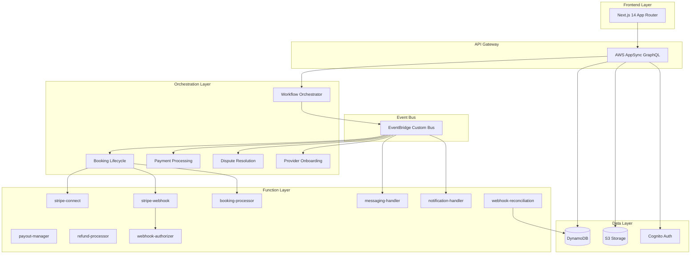
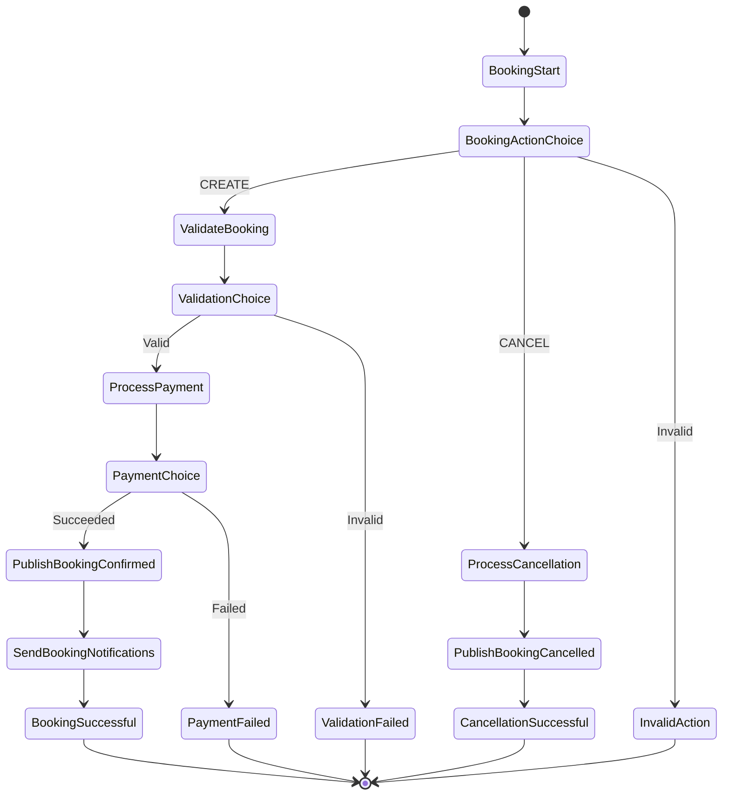
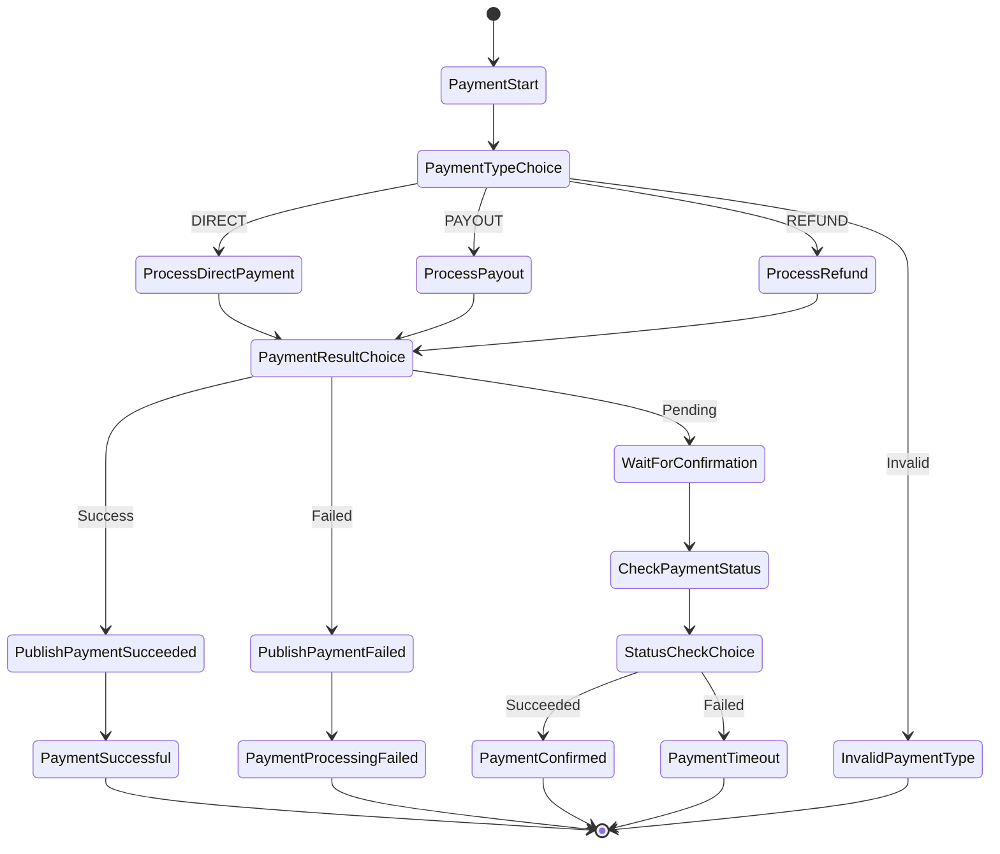
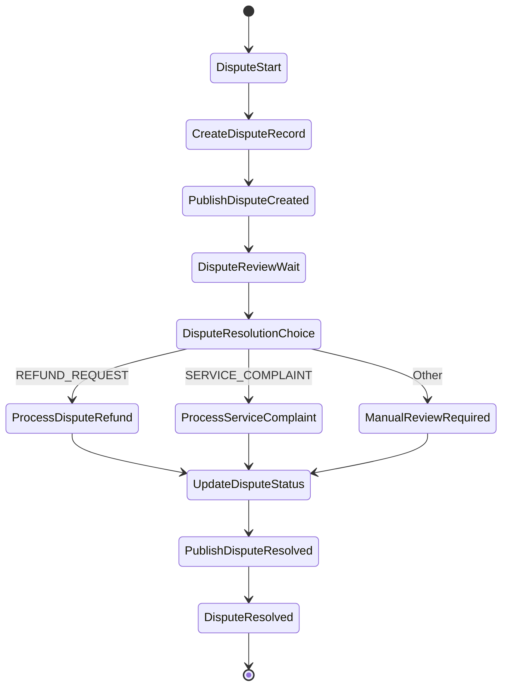
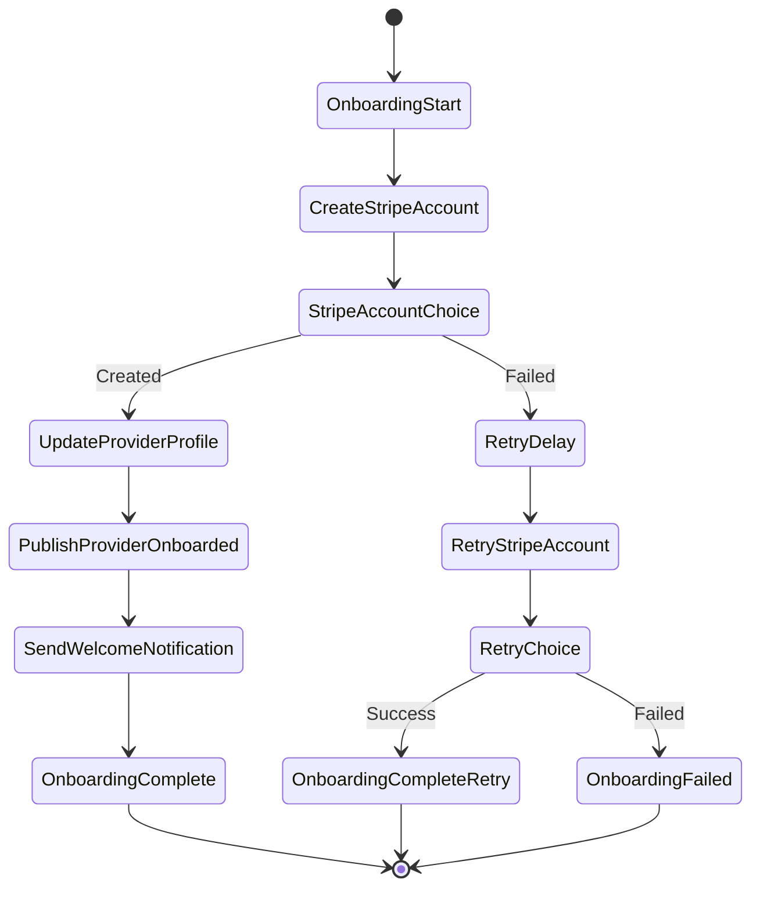
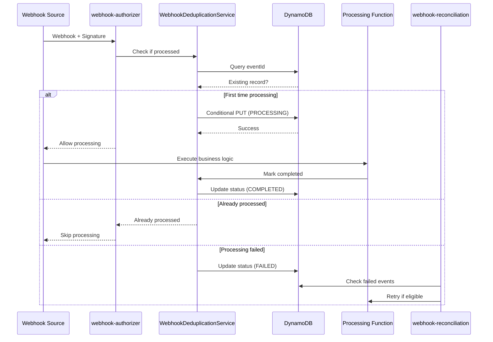

# ECOSYSTEMAWS Marketplace Platform Architecture

## Table of Contents
- [Overview](#overview)
- [EventBridge Architecture](#eventbridge-architecture)
- [Step Functions Workflows](#step-functions-workflows)
- [Lambda Functions](#lambda-functions)
- [Webhook Deduplication System](#webhook-deduplication-system)
- [Migration Status](#migration-status)
- [Data Models](#data-models)
- [Security](#security)
- [Monitoring & Observability](#monitoring--observability)

## Overview

ECOSYSTEMAWS is a comprehensive marketplace platform built on AWS Amplify Gen 2, featuring a sophisticated event-driven architecture using EventBridge and Step Functions. The platform implements a service booking system with integrated Stripe payments, real-time messaging, and robust webhook processing.

### Architecture Principles
- **Event-Driven**: All major operations trigger domain events through EventBridge
- **Workflow Orchestration**: Step Functions manage complex business processes
- **Serverless First**: Lambda functions handle business logic with automatic scaling
- **Resilience by Design**: Circuit breakers, retry logic, and webhook deduplication
- **AppSync-Native**: All integrations use GraphQL with type-safe operations

### High-Level Architecture



## EventBridge Architecture

### Custom Event Bus: `ecosystem-marketplace-events`

The platform uses a dedicated EventBridge bus for all marketplace domain events, ensuring loose coupling and enabling complex event-driven workflows.

#### Event Sources and Patterns

| Source | Event Types | Consumers |
|--------|-------------|-----------|
| `marketplace.booking` | Booking Confirmed, Booking Cancelled, Booking Updated | notification-handler, messaging-handler |
| `marketplace.payment` | Payment Succeeded, Payment Failed, Payout Completed | payout-manager, Step Functions |
| `marketplace.dispute` | Dispute Created, Dispute Resolved | notification-handler |
| `marketplace.provider` | Provider Onboarded, Provider Updated | notification-handler |
| `marketplace.workflow` | Workflow Started, Workflow Stopped, Workflow Error | CloudWatch Logs |

#### Event Flow Diagram

```ascii
┌─────────────────┐    ┌─────────────────────┐    ┌──────────────────────┐
│   Domain Event  │    │    EventBridge      │    │   Event Consumers    │
│   (GraphQL/SF)  │───▶│  Custom Event Bus   │───▶│  Lambda Functions    │
└─────────────────┘    │  Pattern Matching   │    │  Step Functions      │
                       └─────────────────────┘    └──────────────────────┘
                                 │
                                 ▼
                       ┌─────────────────────┐
                       │   CloudWatch Logs   │
                       │   Metrics & Alarms  │
                       └─────────────────────┘
```

## Step Functions Workflows

### 1. Booking Lifecycle Workflow (`ecosystem-booking-lifecycle`)

Orchestrates the complete booking process from creation to completion.



**Timeout**: 15 minutes  
**Logging**: Full execution data with CloudWatch integration

### 2. Payment Processing Workflow (`ecosystem-payment-processing`)

Handles all payment operations including direct payments, payouts, and refunds.



**Timeout**: 10 minutes  
**Wait State**: 30 seconds for payment confirmation

### 3. Dispute Resolution Workflow (`ecosystem-dispute-resolution`)

Automated dispute handling with escalation paths.



**Timeout**: 7 days  
**Wait State**: 24 hours for review period

### 4. Provider Onboarding Workflow (`ecosystem-provider-onboarding`)

Streamlines provider registration and Stripe Connect account setup.



**Timeout**: 30 minutes  
**Retry**: 5-minute delay with single retry attempt

## Lambda Functions

### Core Business Functions

#### 1. stripe-connect
**Purpose**: Handles Stripe Connect operations for provider onboarding and payments  
**Runtime**: Node.js 20  
**Timeout**: 30 seconds  
**AppSync Integration**: `stripeConnect` query  
**Key Operations**:
- Create Stripe Connect accounts
- Process payment intents
- Handle direct charges
- Manage connected account operations

#### 2. stripe-webhook  
**Purpose**: Processes Stripe webhook events with deduplication  
**Runtime**: Node.js 20  
**Timeout**: 60 seconds  
**AppSync Integration**: `stripeWebhook` mutation (custom auth)  
**Key Operations**:
- Webhook signature validation
- Event deduplication
- Database updates based on Stripe events
- Error handling and retry logic

#### 3. booking-processor
**Purpose**: Manages booking lifecycle and business logic  
**Runtime**: Node.js 20  
**Timeout**: 30 seconds  
**AppSync Integration**: `processBooking` mutation  
**Key Operations**:
- Booking validation
- Payment integration
- Status management
- QR code generation

#### 4. payout-manager
**Purpose**: Handles provider payouts and scheduling  
**Runtime**: Node.js 20  
**Timeout**: 60 seconds  
**AppSync Integration**: `processPayouts` mutation  
**Key Operations**:
- Scheduled payouts
- Manual payout triggers
- Commission calculations
- Payout reconciliation

#### 5. refund-processor
**Purpose**: Manages refunds with proper commission handling  
**Runtime**: Node.js 20  
**Timeout**: 30 seconds  
**AppSync Integration**: `processRefund` mutation  
**Key Operations**:
- Full and partial refunds
- Commission adjustment
- Dispute-driven refunds
- Provider payout adjustments

### Communication Functions

#### 6. messaging-handler
**Purpose**: Manages in-app messaging and conversations  
**Runtime**: Node.js 20  
**Timeout**: 30 seconds  
**AppSync Integration**: `sendMessage` mutation, `getMessages` query  
**Key Operations**:
- Message sending and retrieval
- Conversation management
- Read status tracking
- Attachment handling

#### 7. notification-handler
**Purpose**: Handles push and email notifications  
**Runtime**: Node.js 20  
**Timeout**: 30 seconds  
**AppSync Integration**: `sendNotification` mutation, `getNotifications` query  
**Key Operations**:
- Multi-channel notifications
- Event-driven notifications
- User preferences
- Notification history

### Infrastructure Functions

#### 8. workflow-orchestrator
**Purpose**: Manages Step Functions workflow lifecycle  
**Runtime**: Node.js 20  
**Timeout**: 30 seconds  
**AppSync Integration**: `startWorkflow`, `stopWorkflow`, `getWorkflowStatus` mutations  
**Environment Variables**:
- `BOOKING_STATE_MACHINE_ARN`
- `PAYMENT_STATE_MACHINE_ARN`
- `DISPUTE_STATE_MACHINE_ARN`
- `ONBOARDING_STATE_MACHINE_ARN`
- `MARKETPLACE_EVENT_BUS_ARN`

#### 9. webhook-authorizer
**Purpose**: Custom AppSync authorizer for webhook signature validation  
**Runtime**: Node.js 20  
**Timeout**: 30 seconds  
**Key Features**:
- Multi-provider support (Stripe, GitHub, Shopify)
- Timestamp validation
- Signature verification
- Deduplication integration

#### 10. webhook-reconciliation
**Purpose**: Daily reconciliation between Stripe and database  
**Runtime**: Node.js 20  
**Timeout**: 5 minutes  
**Memory**: 512 MB  
**Schedule**: Daily at 2 AM UTC  
**Key Features**:
- Missed event detection
- Failed event retry
- Data consistency verification
- CloudWatch metrics
- SNS alerting

### Supporting Functions

#### 11. post-confirmation-trigger
**Purpose**: Cognito post-confirmation user setup  
**Runtime**: Node.js 20  
**Timeout**: 30 seconds  
**Trigger**: Cognito User Pool post-confirmation

#### 12. profile-events
**Purpose**: User profile event processing  
**Runtime**: Node.js 20  
**Timeout**: 30 seconds

#### 13. bedrock-ai
**Purpose**: AI-powered features using Amazon Bedrock  
**Runtime**: Node.js 20  
**Timeout**: 60 seconds

## Webhook Deduplication System

The platform implements a comprehensive webhook deduplication system to prevent duplicate processing and handle race conditions.

### Architecture Components

```ascii
┌─────────────────┐    ┌──────────────────────┐    ┌─────────────────────┐
│   Webhook       │    │   Webhook           │    │   Processing        │
│   Received      │───▶│   Authorizer        │───▶│   Lambda            │
└─────────────────┘    │   - Signature check │    │   - Business logic  │
                       │   - Dedup check     │    │   - State updates   │
                       └──────────────────────┘    └─────────────────────┘
                                 │                           │
                                 ▼                           ▼
                       ┌──────────────────────┐    ┌─────────────────────┐
                       │   ProcessedWebhooks  │    │   Result Storage    │
                       │   DynamoDB Table     │    │   & Metrics         │
                       └──────────────────────┘    └─────────────────────┘
```

### Deduplication Flow



### WebhookDeduplicationService Features

#### Atomic Lock Acquisition
Uses DynamoDB conditional writes for distributed locking:

```typescript
// Prevents race conditions with conditional expression
ConditionExpression: 'attribute_not_exists(eventId)'

// For retries with lock timeout
ConditionExpression: 'attribute_exists(eventId) AND (processingStartedAt < :lockExpiry)'
```

#### Status Management
- **PROCESSING**: Currently being processed (with timeout)
- **COMPLETED**: Successfully processed
- **FAILED**: Processing failed (with retry count)
- **SKIPPED**: Intentionally skipped (duplicate)

#### Reconciliation Features
- **Daily Reconciliation**: Runs at 2 AM UTC
- **Missed Event Detection**: Compares Stripe events with processed records
- **Failed Event Retry**: Retries eligible failed events
- **Data Consistency Verification**: Validates database against Stripe state
- **Metrics & Alerting**: CloudWatch metrics and SNS alerts for critical issues

## Migration Status

### Lambda URL to AppSync Migration

The platform is in the process of migrating from Lambda Function URLs to a pure AppSync architecture for better security, type safety, and integration.

#### Migration Status by Function

| Function | Status | AppSync Operation | Feature Flag |
|----------|--------|------------------|--------------|
| ✅ stripe-connect | **COMPLETED** | `stripeConnect` query | `NEXT_PUBLIC_USE_APPSYNC_STRIPE_CONNECT` |
| 🔄 stripe-webhook | **IN PROGRESS** | `stripeWebhook` mutation | TBD |
| ⏳ payout-manager | **PLANNED** | `processPayouts` mutation | TBD |
| ⏳ refund-processor | **PLANNED** | `processRefund` mutation | TBD |
| ⏳ booking-processor | **PLANNED** | `processBooking` mutation | TBD |
| ⚠️ messaging-handler | **PARTIAL** | `sendMessage`, `getMessages` | TBD |
| ⏳ notification-handler | **PLANNED** | `sendNotification`, `getNotifications` | TBD |

#### Architecture Mandate: AppSync-Only

**CRITICAL RULE**: All new and migrated backend functionality MUST use the AppSync pattern. The creation or use of Lambda Function URLs is strictly FORBIDDEN.

##### Prohibited Practices
- ❌ NEVER create Lambda Function URLs
- ❌ NEVER add `*_LAMBDA_URL` environment variables
- ❌ NEVER use direct Lambda invocation from frontend
- ❌ NEVER run `scripts/setup-lambda-urls.sh` or similar scripts

##### Required Practices
- ✅ ALWAYS use AppSync mutations/queries for Lambda integration
- ✅ ALWAYS use the amplify-client-wrapper for API calls
- ✅ ALWAYS implement feature flags for gradual migration
- ✅ ALWAYS write tests for both legacy and new architectures during migration

## Data Models

### Core Tables

#### ProcessedWebhooks
```typescript
{
  eventId: string;          // Primary key
  processedAt: number;      // Timestamp
  processingStartedAt?: number;
  processingCompletedAt?: number;
  status: 'PROCESSING' | 'COMPLETED' | 'FAILED' | 'SKIPPED';
  result?: any;             // Processing result
  error?: string;           // Error message if failed
  retryCount: number;       // Retry attempts
  ttl: number;             // DynamoDB TTL
  correlationId?: string;   // Request tracing
  signature?: string;       // Webhook signature
  source: string;          // Webhook source (stripe, github, etc.)
}
```

#### UserProfile
```typescript
{
  id: string;              // Primary key
  email: string;           // Required
  firstName?: string;
  lastName?: string;
  userType?: string;       // customer, provider, admin
  stripeAccountId?: string; // Stripe Connect account
  stripeCustomerId?: string;
  profileOwner: string;    // Authorization field
}
```

#### Booking
```typescript
{
  id: string;              // Primary key
  serviceId: string;       // Foreign key
  customerId: string;      // Foreign key
  providerId: string;      // Foreign key
  startDateTime: string;   // ISO string
  endDateTime: string;     // ISO string
  status: string;          // pending, confirmed, completed, cancelled
  paymentStatus?: string;  // pending, succeeded, failed
  paymentIntentId?: string; // Stripe payment intent
  amount?: number;
  platformFee?: number;    // 8% platform commission
  providerEarnings?: number;
  currency?: string;
  // ... additional booking fields
}
```

### Indexes and Access Patterns

#### GSI: PaymentIntentIndex
- **Partition Key**: `paymentIntentId`
- **Purpose**: Lookup bookings by Stripe payment intent
- **Used by**: Webhook processing, reconciliation

#### GSI: ProviderBookingsIndex
- **Partition Key**: `providerId`
- **Sort Key**: `startDateTime`
- **Purpose**: Provider booking history and scheduling

#### GSI: CustomerBookingsIndex
- **Partition Key**: `customerId`
- **Sort Key**: `startDateTime`
- **Purpose**: Customer booking history

## Security

### Authentication & Authorization

#### Cognito User Pool
- **Primary Auth**: AWS Cognito with post-confirmation trigger
- **User Types**: Customer, Provider, Admin
- **MFA**: Optional SMS/TOTP
- **Password Policy**: AWS managed

#### AppSync Authorization Modes

1. **User Pool (Primary)**
   - Authenticated users with JWT tokens
   - Owner-based access control
   - Group-based permissions

2. **Lambda Authorizer (Webhooks)**
   - Custom signature validation
   - Multi-provider support
   - TTL caching (5 minutes)

3. **API Key (Development)**
   - 30-day expiration
   - Limited to development/testing

### IAM Security

#### Least Privilege Principle
Each Lambda function has minimal required permissions:

```typescript
// Example: stripe-webhook permissions
{
  "Version": "2012-10-17",
  "Statement": [
    {
      "Effect": "Allow",
      "Action": [
        "dynamodb:GetItem",
        "dynamodb:PutItem",
        "dynamodb:UpdateItem"
      ],
      "Resource": "arn:aws:dynamodb:*:*:table/ProcessedWebhooks*"
    }
  ]
}
```

#### Cross-Service Permissions
- **EventBridge**: Lambda functions can publish events
- **Step Functions**: Workflow orchestrator can start/stop executions
- **SNS**: Reconciliation function can publish alerts
- **CloudWatch**: All functions can write metrics

### Webhook Security

#### Signature Validation
- **Stripe**: HMAC-SHA256 with timestamp validation (5-minute tolerance)
- **GitHub**: SHA256 signature verification
- **Shopify**: Base64 HMAC validation

#### Rate Limiting
- **AppSync**: Built-in request throttling
- **Lambda**: Concurrent execution limits
- **DynamoDB**: Provision/on-demand capacity management

## Monitoring & Observability

### CloudWatch Integration

#### Metrics
- **Custom Namespace**: `ECOSYSTEMAWS/Webhooks`
- **Metrics Tracked**:
  - `WebhookReconciliation.EventsChecked`
  - `WebhookReconciliation.MissedEvents`
  - `WebhookReconciliation.FailedEvents`
  - `WebhookReconciliation.SuccessfulRetries`
  - `WebhookReconciliation.Discrepancies`

#### Logging
- **Step Functions**: Full execution data with CloudWatch Logs
- **Lambda Functions**: Structured JSON logging
- **Correlation IDs**: Request tracing across services
- **Log Groups**: Organized by service with retention policies

#### Alarms and Alerting
- **SNS Topics**: 
  - `webhook-reconciliation-alerts`
  - `critical-system-alerts`
- **Alert Conditions**:
  - Critical webhook discrepancies
  - System failures in reconciliation
  - Failed workflow executions
  - High error rates

### X-Ray Tracing
- **Enabled**: Step Functions with distributed tracing
- **Correlation**: Request IDs propagated through EventBridge
- **Performance**: End-to-end latency monitoring

### Health Checks
- **Reconciliation Health**: Daily verification reports
- **Webhook Processing**: Real-time status monitoring
- **Data Consistency**: Automated consistency checks

## Operational Runbooks

### Daily Operations
1. **Review Reconciliation Report** (2:30 AM UTC daily)
2. **Check Failed Webhooks** for manual intervention
3. **Monitor Step Function Executions** for stuck workflows
4. **Verify Payment Consistency** between Stripe and database

### Incident Response
1. **Webhook Processing Failure**
   - Check webhook-authorizer logs
   - Verify signature validation
   - Manual reconciliation if needed

2. **Step Function Execution Stuck**
   - Review execution history
   - Check Lambda function logs
   - Manual stop/restart if required

3. **Payment Discrepancy**
   - Compare Stripe dashboard with database
   - Run manual reconciliation
   - Contact customer support if needed

---

*This architecture documentation reflects the current state as of the latest deployment. For implementation details, refer to the source code and individual function documentation.*