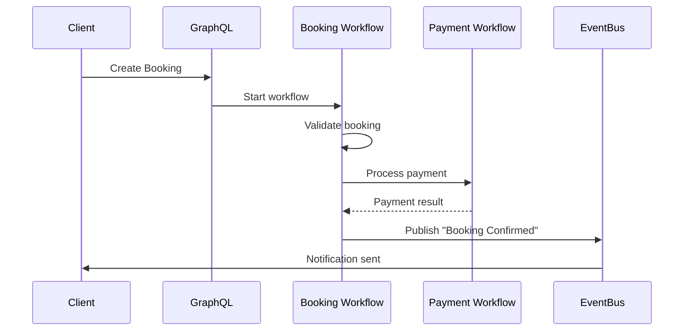
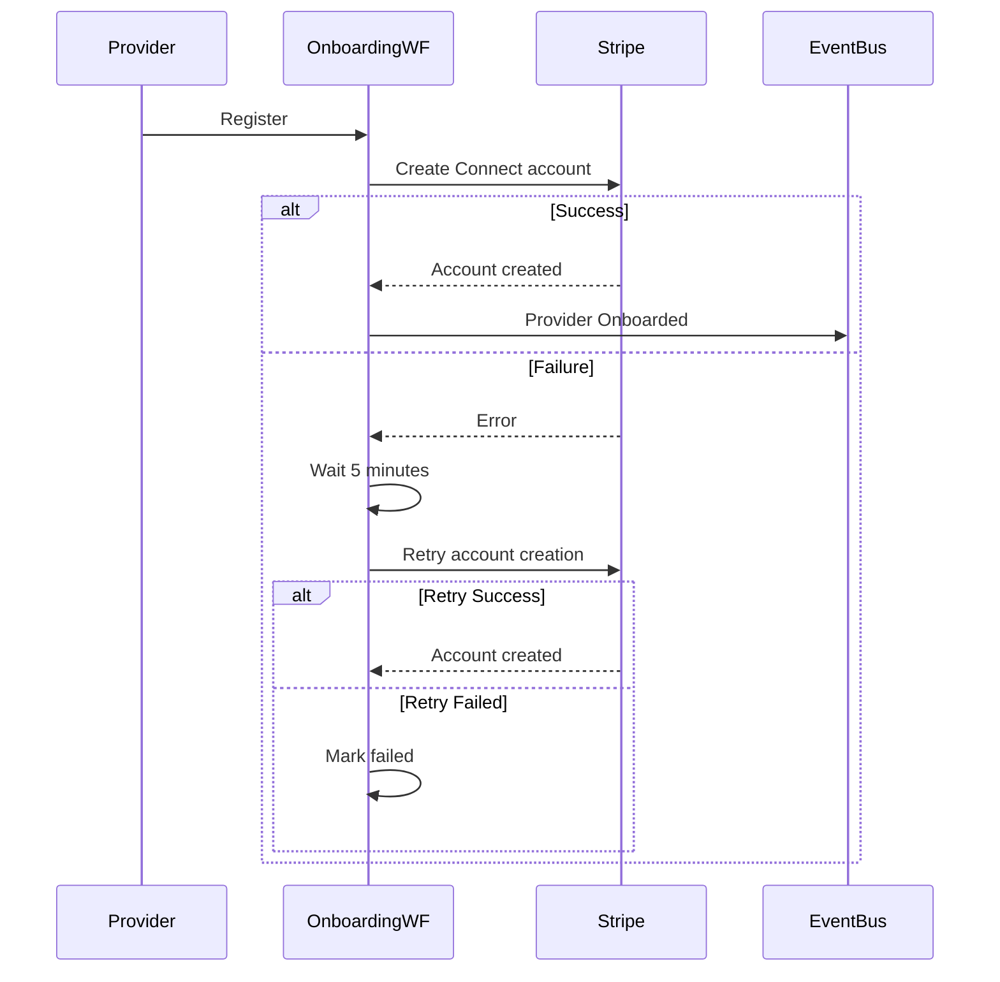

# Step Functions Workflow Quick Reference

## Workflow State Machine ARNs

### Environment Variables (Available in workflow-orchestrator)
```bash
BOOKING_STATE_MACHINE_ARN=arn:aws:states:region:account:stateMachine:ecosystem-booking-lifecycle
PAYMENT_STATE_MACHINE_ARN=arn:aws:states:region:account:stateMachine:ecosystem-payment-processing
DISPUTE_STATE_MACHINE_ARN=arn:aws:states:region:account:stateMachine:ecosystem-dispute-resolution
ONBOARDING_STATE_MACHINE_ARN=arn:aws:states:region:account:stateMachine:ecosystem-provider-onboarding
MARKETPLACE_EVENT_BUS_ARN=arn:aws:events:region:account:event-bus/ecosystem-marketplace-events
```

## Workflow Trigger Patterns

### Booking Lifecycle Workflow

#### Start via GraphQL
```graphql
mutation StartBookingWorkflow {
  startWorkflow(
    workflowType: "BOOKING_LIFECYCLE"
    input: {
      action: "CREATE"
      bookingId: "booking-123"
      serviceId: "service-456"
      customerId: "customer-789"
      startDateTime: "2024-01-15T10:00:00Z"
      endDateTime: "2024-01-15T12:00:00Z"
      amount: 100.00
    }
    executionName: "booking-creation-123"
  ) {
    success
    executionArn
    status
  }
}
```

#### Start via EventBridge
**Event Pattern**: `marketplace.booking:Booking Created`
```json
{
  "source": "marketplace.booking",
  "detail-type": "Booking Created",
  "detail": {
    "bookingId": "booking-123",
    "action": "CREATE",
    "customerId": "customer-789",
    "providerId": "provider-456",
    "amount": 100.00
  }
}
```

### Payment Processing Workflow

#### Direct Payment Example
```graphql
mutation StartPaymentWorkflow {
  startWorkflow(
    workflowType: "PAYMENT_PROCESSING"
    input: {
      paymentType: "DIRECT"
      paymentIntentId: "pi_123456789"
      amount: 100.00
      customerId: "customer-789"
      providerId: "provider-456"
      bookingId: "booking-123"
    }
  ) {
    success
    executionArn
  }
}
```

#### Payout Example
```graphql
mutation StartPayoutWorkflow {
  startWorkflow(
    workflowType: "PAYMENT_PROCESSING"
    input: {
      paymentType: "PAYOUT"
      providerId: "provider-456"
      amount: 92.00
      connectedAccountId: "acct_123456789"
    }
  ) {
    success
    executionArn
  }
}
```

### Dispute Resolution Workflow

#### Refund Request
```graphql
mutation StartDisputeWorkflow {
  startWorkflow(
    workflowType: "DISPUTE_RESOLUTION"
    input: {
      disputeType: "REFUND_REQUEST"
      bookingId: "booking-123"
      customerId: "customer-789"
      providerId: "provider-456"
      amount: 100.00
      description: "Service not provided as described"
    }
  ) {
    success
    executionArn
  }
}
```

### Provider Onboarding Workflow

#### New Provider Registration
```graphql
mutation StartOnboardingWorkflow {
  startWorkflow(
    workflowType: "PROVIDER_ONBOARDING"
    input: {
      providerId: "provider-new-123"
      email: "provider@example.com"
      businessInfo: {
        type: "individual",
        firstName: "John",
        lastName: "Doe",
        businessName: "John's Services"
      }
    }
  ) {
    success
    executionArn
  }
}
```

## Workflow Status Management

### Check Execution Status
```graphql
query GetWorkflowStatus {
  getWorkflowStatus(
    executionArn: "arn:aws:states:region:account:execution:ecosystem-booking-lifecycle:booking-123-1234567890"
    workflowType: "BOOKING_LIFECYCLE"
  ) {
    success
    status
    output
  }
}
```

### Stop Running Execution
```graphql
mutation StopWorkflow {
  stopWorkflow(
    executionArn: "arn:aws:states:region:account:execution:ecosystem-booking-lifecycle:booking-123-1234567890"
    workflowType: "BOOKING_LIFECYCLE"
  ) {
    success
    status
  }
}
```

## Event-Driven Triggers

### Auto-Trigger Mapping
The `workflow-orchestrator` automatically starts workflows based on EventBridge events:

| Event Pattern | Triggered Workflow | Execution Name Pattern |
|---------------|-------------------|------------------------|
| `marketplace.booking:Booking Created` | BOOKING_LIFECYCLE | `booking-{bookingId}-{timestamp}` |
| `marketplace.payment:Payment Intent Created` | PAYMENT_PROCESSING | `payment-{paymentIntentId}-{timestamp}` |
| `marketplace.dispute:Dispute Filed` | DISPUTE_RESOLUTION | `dispute-{disputeId}-{timestamp}` |
| `marketplace.provider:Registration Completed` | PROVIDER_ONBOARDING | `onboarding-{providerId}-{timestamp}` |

## Common Workflow Patterns

### Booking with Payment Flow


### Provider Onboarding with Retry


## Error Handling

### Workflow Failure States
All workflows include proper error handling with specific failure states:

- **ValidationFailed**: Input validation errors
- **PaymentFailed**: Payment processing failures  
- **ProcessingFailed**: General processing errors
- **TimeoutError**: Operation timeouts
- **InvalidActionError**: Invalid workflow actions

### Monitoring Failed Executions
```bash
# AWS CLI command to list failed executions
aws stepfunctions list-executions \
  --state-machine-arn $BOOKING_STATE_MACHINE_ARN \
  --status-filter FAILED \
  --max-items 10
```

### Manual Recovery
```graphql
# Restart failed booking workflow
mutation RestartBookingWorkflow {
  startWorkflow(
    workflowType: "BOOKING_LIFECYCLE"
    input: {
      # Same input as failed execution
      action: "CREATE"
      bookingId: "booking-123"
      # ... other fields
    }
    executionName: "booking-123-retry-1234567890"
  ) {
    success
    executionArn
  }
}
```

## Performance Characteristics

### Execution Times (Average)
- **Booking Lifecycle**: 2-5 seconds (success path)
- **Payment Processing**: 3-8 seconds (including Stripe API calls)
- **Dispute Resolution**: 24+ hours (due to review wait period)
- **Provider Onboarding**: 10-30 seconds (depending on Stripe response)

### Timeout Configuration
- **Booking Lifecycle**: 15 minutes maximum
- **Payment Processing**: 10 minutes maximum
- **Dispute Resolution**: 7 days maximum
- **Provider Onboarding**: 30 minutes maximum

## Troubleshooting

### Common Issues

#### 1. Workflow Stuck in RUNNING State
```bash
# Check execution details
aws stepfunctions describe-execution \
  --execution-arn "arn:aws:states:region:account:execution:workflow:name"

# If truly stuck, stop the execution
aws stepfunctions stop-execution \
  --execution-arn "arn:aws:states:region:account:execution:workflow:name"
```

#### 2. Lambda Function Timeouts
- Check CloudWatch logs for the specific Lambda function
- Verify timeout settings in function configuration
- Look for AWS service API rate limiting

#### 3. Invalid Input Parameters
- Validate input JSON structure against workflow requirements
- Check for missing required fields
- Verify data types (strings, numbers, booleans)

#### 4. EventBridge Integration Issues
- Verify event bus ARN in environment variables
- Check EventBridge rule configurations
- Confirm Lambda function permissions for EventBridge

---

*For detailed implementation, see the main [ARCHITECTURE.md](./ARCHITECTURE.md) document.*